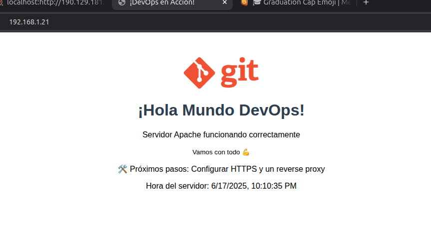

# 📅 Día 02/90 - Introducción a Linux y la Terminal

> "La mejor forma de aprender DevOps... es haciéndolo." - Roxs.

## ✅ Desafíos del Día 2:

### 1️⃣ 🌎 Desplegando un "Hola Mundo" en Apache

#### ⚒️ Requistos previos

#### 🔸 Maquina con Ubuntu/Debian (Fisica o virtual)

voy a trabajar en una maquina fisica

##### **Paso 1:** actualizar el sistema con los comandos 👇

```bash
sudo apt update && sudo upgrade -y
```

##### **Paso 2:** instalar Apache con los comandos 👇

```bash
sudo apt install apache2 -y
```

##### **Paso 3:** verificar el servicio de apache2 que este funcionando correctamente 👇

```bash
sudo systemctl status apache2
```

✅ si muestra active (running) color verde el servicio esta correcto

##### **Paso 4**: Crear pagina pero antes ejecutar los siguientes comandos👇

```bash
cd /var/www/html
sudo nano index.html
```

se inserta el siguiente codigo HTML

```html
<!DOCTYPE html>
<html>
  <head>
    <meta charset="utf-8" />
    <title>¡DevOps en Acción!</title>
    <style>
      body {
        font-family: Arial, sans-serif;
        text-align: center;
        margin-top: 50px;
      }
      h1 {
        color: #2c3e50;
      }
      .logo {
        width: 150px;
      }
    </style>
  </head>
  <body>
    
    <h1>¡Hola Mundo DevOps!</h1>
    <p>Servidor Apache funcionando correctamente</p>
    <small>vamos con todo💪</small>
    <p>🛠️ Próximos pasos: Configurar HTTPS y un reverse proxy</p>
  </body>
</html>
```

##### **Paso 5**: ejecutar el comando para recargar el servicio de apache2👇

```bash
sudo systemctl restart apache2
```

### 🎓 Reto adicional mostrar hora del servidor

```javascript
<script>
  document.write("Hora del servidor: " + new Date().toLocaleString());
</script>
```

## 🖥️ Resultado Final


