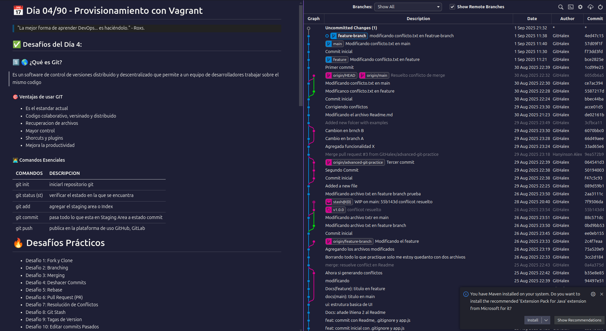

# 📅 Día 04/90 - Provisionamiento con Vagrant

> "La mejor forma de aprender DevOps... es haciéndolo." - Roxs.

## ✅ Desafíos del Día 4:

### 1️⃣ 🌎 ¿Qué es Git?

Es un software de control de versiones distribuido y descentralizado que permite a un equipo de desarrolladores trabajar sobre el mismo codigo

#### 🎯 Ventajas de usar GIT

- Es el estandar actual
- Codigo colaborativo, versinado y distribuido
- Recuperacion de archivos
- Mayor control
- Shorcuts y plugins
- Mejora la productividad

#### 🧑‍💻 Comandos Esenciales

| **COMANDOS**    | **DESCRIPCION**                                       |
| --------------- | ----------------------------------------------------- |
| git init        | iniciarl repositorio git                              |
| git status (st) | verificar el estado en la que se encuantra            |
| git add         | agregar el staging area o Index                       |
| git commit      | pasa todo lo que esta en Staging Area a estado commit |
| git push        | publica en la plataforma de uso GitHub, GitLab        |

# 🔥 Desafíos Prácticos

- Desafio 1: Fork y Clone
- Desafio 2: Branching
- Desafio 3: Merging
- Desafio 4: Deshacer Commits
- Desafio 5: Rebase
- Desafio 6: Pull Request (PR)
- Desafio 7: Resolución de Conflictos
- Desafio 8: Git Stash
- Desafio 9: Tagas de Version
- Desafio 10: Editar commits Pasados

# 💡 Bonus: Estructura del .git

```bash
📂 .git/
├── 📁 hooks/          # Scripts de automatización
├── 📁 objects/        # Almacena todos los objetos Git
├── 📁 refs/           # Referencias a commits
│   ├── 📁 heads/      # Branches locales
│   └── 📁 remotes/    # Branches remotas
├── 📄 config          # Configuración del repositorio
├── 📄 HEAD            # Apunta a la branch actual
└── 📄 index           # Área de staging
```

## 🚀 Git Avanzado - Rebase, Cherry-pick, Resolución de Conflictos

### Técnicas Avanzadas

- Git Rebase - Deep dive y reescritura de historial
- Git Cherry-pick - Aplicar commits especificos entre branches
- Resolucion de conflictos - Identificar y resolver conflictos eficientemente
- Reescritura de Historial -Casos de uso avanzados
- Amending Commits - Modificar commits sin cambiar historial
- Git Hooks - Automatizacion con pre-commit y post-commit hooks

# 🔥 Desafíos Avanzados

## Desafio 1: Rebase Interactivo

**Objetivo**: Modificar historial de commits (renombrar, squash, reordenar)

## Desafio 2: Cherry-pick

**Objetivo**: aplicar commit especifico de otra branch

## Desafio 3: Escenario de conflicto de Merge

**Objetivo**: Crear y resolver conflictos usando merge y rebase

## Desafio 4: Deshacer commits

**Objetivo**: Usar git reset y gir revert - entender diferencias

## Desafio 5: Amend de Commits

**Objetivo**: Modificar ultimo commit sin cambiar historial

## Desafio 6: Git Hooks

**Objetivo**: Configurar hooks para automatizar varificaciones

## Desafio 7: Rebase de Feature Branch

**Objetivo**: Rebase feature sobre main sin merge commits

## Desafio 8: Squash de Commits

**Objetivo**: Combinar multiples commits en uno solo

## 🖥️ Resultado Final


